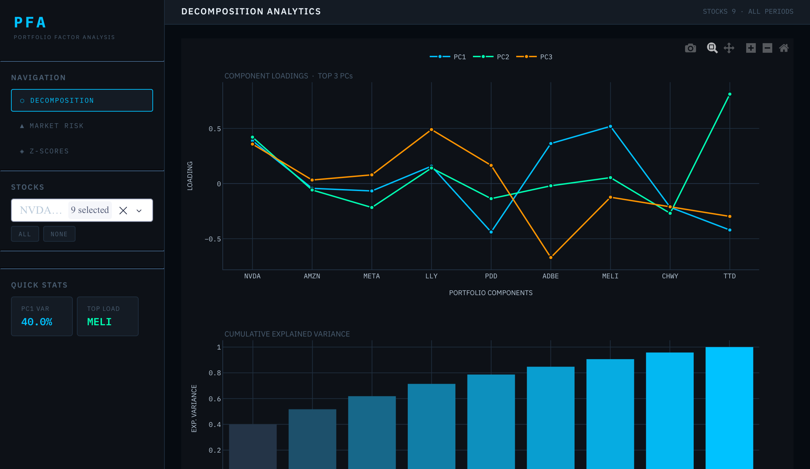
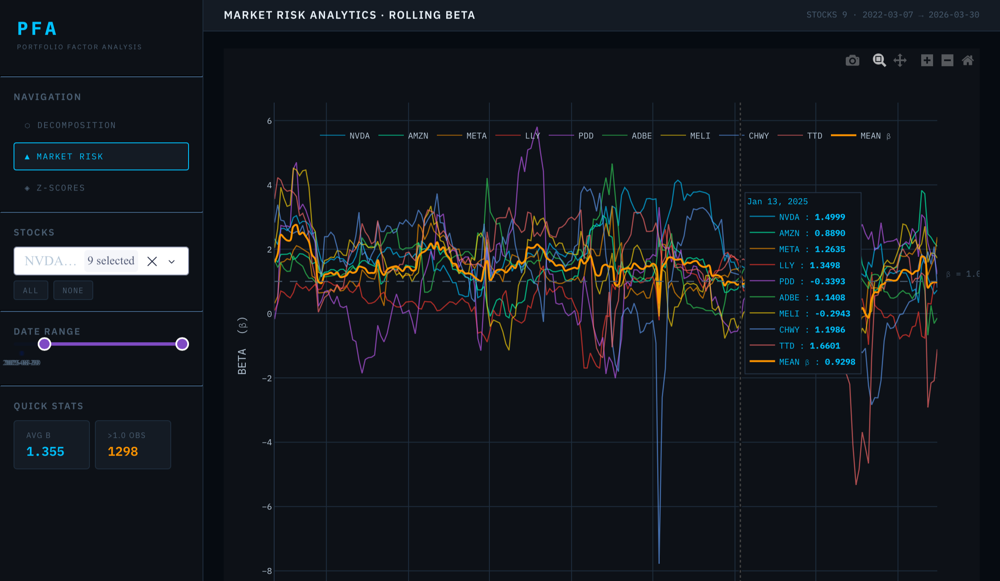
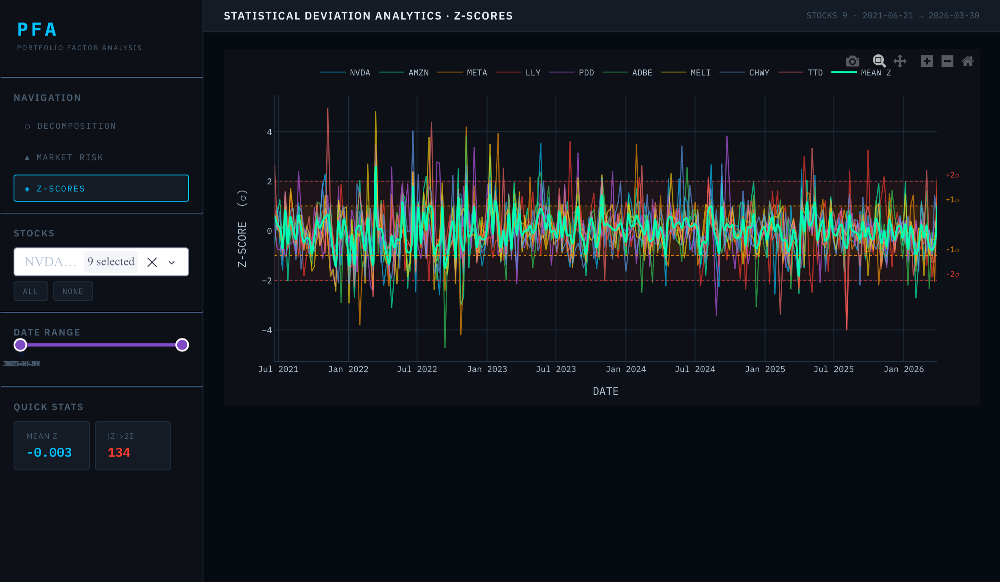

# PFA · Portfolio Factor Analysis

> A Bloomberg Terminal-style Dash application for decomposing, monitoring, and acting on the factor structure of an equity portfolio.

---

## Table of Contents

- [Overview](#overview)
- [Features](#features)
- [Installation](#installation)
- [Dashboard Modules](#dashboard-modules)
- [Use Cases](#use-cases)
  - [Factor-Based Portfolio Construction](#factor-based-portfolio-construction)
  - [Risk Monitoring](#risk-monitoring)
  - [Statistical Arbitrage & Mean Reversion](#statistical-arbitrage--mean-reversion)
- [Project Structure](#project-structure)
- [Dependencies](#dependencies)
- [License](#license)

---

## Overview

PFA is a self-contained analytical dashboard built on top of **Dash** and **Plotly**. It exposes the latent factor structure of a portfolio through three lenses — principal component decomposition, rolling market betas, and cross-sectional z-scores — all within a terminal-style dark UI designed for professional use.

The application is built around a single `pfa` object that encapsulates your data and analytics logic.

---

## Features

| Module | What it shows |
|---|---|
| **Decomposition** | PC loadings per stock, cumulative explained variance by component |
| **Market Risk** | Rolling beta per stock, portfolio mean beta, β = 1 reference |
| **Z-Scores** | Cross-sectional z-scores over time, ±1σ / ±2σ deviation bands |

**UI capabilities:**

- Sidebar navigation with active-state highlighting
- Stock multiselect with ALL / NONE shortcuts
- Date range slider (Betas & Z-Scores modules)
- Live quick-stats panel (avg β, |Z| > 2σ extremes, PC1 variance share)
- Export any chart to PNG via the Plotly toolbar
- Fully dark, monospaced Bloomberg-style theme (IBM Plex Mono + IBM Plex Sans)

---

## Installation

```bash
pip install dash pandas numpy plotly
```

No additional UI libraries required — the app uses plain Dash only.

Optionally, for nicer fonts in the browser, an internet connection is sufficient (Google Fonts CDN is used for IBM Plex).

---

## Dashboard Modules

### Decomposition



The decomposition view runs a **Principal Component Analysis** (PCA) on your return covariance matrix and shows:

- **Component Loadings** — how much each stock contributes to PC1, PC2, PC3. Stocks with large absolute loadings on PC1 are the dominant drivers of portfolio variance.
- **Explained Variance** — the share of total portfolio variance captured by each PC, displayed as a gradient bar chart. A steep drop-off after PC1 indicates a highly concentrated factor structure.

### Market Risk · Rolling Beta



The beta panel plots each stock's market sensitivity over time alongside the equal-weighted portfolio mean. The `β = 1.0` dashed reference marks the boundary between defensive and aggressive exposures. Quick-stats show average beta and the number of observations where any stock exceeded the market.

### Z-Scores



The z-score panel shows how far each stock deviates from the cross-sectional mean return at each point in time. Shaded bands at ±1σ and ±2σ make distributional extremes immediately visible. The quick-stats card counts all `|Z| > 2σ` observations — a practical proxy for the frequency of statistical outliers in the portfolio.

---

## Use Cases

### Factor-Based Portfolio Construction

PCA decomposition is the foundation of **factor investing**. The loading chart immediately answers: *which stocks load most heavily on which factors?*

- Stocks with high positive PC1 loading tend to move together and represent the dominant systematic risk. Deliberately **underweighting these** reduces concentration.
- Stocks that load on PC2 or PC3 — orthogonal to the dominant factor — provide **diversification** that is invisible in a simple correlation matrix.
- You can use the explained variance chart to decide how many factors are worth modelling explicitly. A rule of thumb: retain PCs that together explain ≥ 80% of variance.

**Practical workflow:** identify the top-3 PC loadings → group stocks by factor exposure → size positions inversely proportional to factor concentration.

---

### Risk Monitoring

The dashboard doubles as a live risk monitor:

- **Beta creep.** Watch for the portfolio mean beta drifting above your target over time — a common consequence of momentum in bull markets. The quick-stat card flags this immediately.
- **Factor concentration.** If PC1 explained variance increases significantly period-over-period, the portfolio is becoming more concentrated in a single systematic risk. This often precedes correlation spikes during market stress.
- **Tail exposure.** The `|Z| > 2σ` counter in the z-score panel quantifies how many stock-date observations are in the statistical tails. A rising count without a corresponding fundamental catalyst is a warning sign of model breakdown or regime change.

---

### Statistical Arbitrage & Mean Reversion

Z-scores are the core signal in **pairs trading and stat-arb** strategies:

1. Identify stock pairs or baskets with stable co-integration using the decomposition view (co-integrated assets share PC loadings).
2. Monitor the spread z-score in the z-scores panel. Entry when `|Z| > 2`, exit at `Z ≈ 0`.
3. Use the ±1σ / ±2σ bands as visual confirmation of entry and exit thresholds.
4. The portfolio mean z-score line (green) shows whether the entire portfolio is in aggregate reverting or trending — useful for scaling position size.

---

## Project Structure

```
pfa/
├── app.py          # Dash app init and layout
└── factoranalysis.py    # PFA class and instance
```

---

## Dependencies

| Package | Purpose |
|---|---|
| `dash` | Web application framework |
| `plotly` | Interactive charting |
| `pandas` | DataFrame handling |
| `numpy` | Numerical operations |


Python ≥ 3.9 recommended.

---

## License

MIT — use freely, attribution appreciated.
